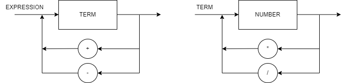

# Repositório de Lógica da Computação

### Status dos testes


#### Diagrama sintático



#### EBNF

```python
EXPRESSION = TERM, { ("+" | "-"), TERM };
TERM = FACTOR, { ("*" | "/"), FACTOR };
FACTOR = ("+" | "-") FACTOR | "(" EXPRESSION ")" | number ;
```
