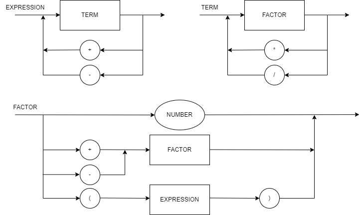

# Repositório de Lógica da Computação

### Status dos testes

#### Diagrama sintático

#### EBNF

STATEMENT = ( λ | ASSIGNMENT | PRINT | WHILE | IF), "\n" ;
WHILE = "while", "(", RELEXPR, ")", STATEMENT;
IF = "if", "(", RELEXPR, ")", STATEMENT, {"else", STATEMENT};
EXPRESSION = TERM, { ("+" | "-"), TERM } ;
TERM = FACTOR, { ("*" | "/" | "&&" | "."), FACTOR } ;
RELEXPR = EXPRESSION, { ("<" | ">" | "==" ), EXPRESSION } ;
FACTOR = (NUMBER | STRING | IDENTIFIER | ("+" | "-" | "!"), FACTOR) | "(", RELEXPR, ")" | ("readine", "(", ")");
IDENTIFIER = LETTER, { LETTER | DIGIT | "_" } ;
ASSIGNMENT = IDENTIFIER,("::", TYPE, ["=",RELEXPR] |"=", RELEXPR );
TYPE = "Int" | "String";
PRINT = "println", "(", RELEXPR, ")" ;
NUMBER = DIGIT, { DIGIT } ;
LETTER = ( a | ... | z | A | ... | Z ) ;
DIGIT = ( 1 | 2 | 3 | 4 | 5 | 6 | 7 | 8 | 9 | 0 ) ;